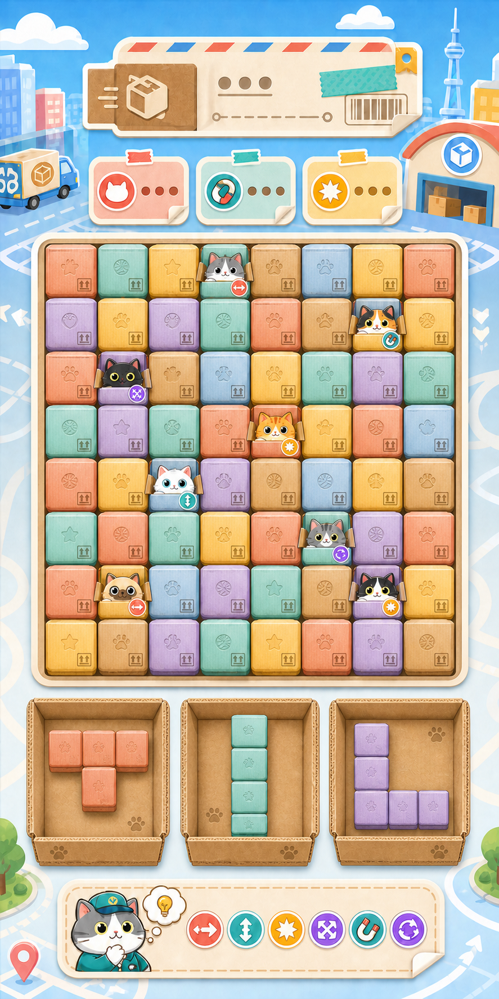

# CatBlock 美术风格规范

本文档定义 CatBlock 的统一视觉语言，是 UI、角色、纸箱、图标、特效、宣传图和 AI 生图的项目级美术依据。

## 1. 主参考图



- 文件路径：`docs/art/catblock-main-art-reference.png`
- 画面规格：887 × 1774，竖屏 1:2。
- 参考优先级：主参考图 > 本文档中的明确规则 > 单次需求中的补充说明。
- 主参考图用于确定整体气质、配色比例、材质、轮廓、UI 层级和元素密度，不要求逐像素复制其中的临时数字、图标或布局细节。
- 当玩法可读性、实际屏幕安全区或 Cocos 节点约束与参考图冲突时，优先保证玩法可读性和交互一致性，但不得擅自改变核心视觉语言。

## 2. 世界观与视觉主题

玩家是城市猫咪快递中心的分拣员。每一个可操作方块都是一只快递纸箱；部分纸箱在放置或消除时会探出猫咪，并触发不同能力。界面需要同时传达三层信息：

1. 这是一个明快、轻松的城市快递世界。
2. 棋盘上的基础单位始终是纸箱，而不是宝石、糖果或普通色块。
3. 猫咪与技能是纸箱上的特殊状态，不能破坏纸箱的统一轮廓和棋盘秩序。

整体关键词：`可爱快递`、`彩色纸箱`、`清爽贴纸`、`纸张触感`、`城市晴天`、`规则清晰`、`轻量收藏感`。

## 3. 整体风格

- 采用精致的 2D 休闲手游插画风，结合贴纸式轮廓、轻量体积感和真实可辨的纸张纹理。
- 造型圆润、稳定、正视图为主；交互元素避免强透视和过度倾斜。
- 阴影柔和且短，主要用于区分层级，不追求写实光照。
- 外轮廓使用深可可棕，不使用纯黑；内部纹理使用同色系明暗变化。
- 画面明亮、温暖、干净，不走工业写实、赛博、暗黑、金属机械或高光塑料路线。
- 装饰需要服务主题和层级，不能覆盖棋盘、纸箱轮廓、猫咪表情或技能标识。

## 4. 核心配色

以下色值是主参考图的建议基准，可在同色相内小幅调整明度和饱和度：

| 用途 | 建议色值 | 说明 |
| --- | --- | --- |
| 天空蓝 | `#67C8F3` | 外围背景与城市氛围 |
| 奶油白 | `#FFF5DF` | UI 面板、留白和高亮 |
| 可可棕 | `#684832` | 轮廓、纸箱暗边、主要深色文字 |
| 牛皮纸 | `#C89155` | 货箱、自然色纸箱和纸张结构 |
| 珊瑚红 | `#F18772` | 彩色纸箱、横向类技能 |
| 薄荷绿 | `#78CDBE` | 彩色纸箱、辅助或吸附类技能 |
| 奶油黄 | `#F5C85D` | 彩色纸箱、爆发或奖励类技能 |
| 粉蓝色 | `#8CC6E5` | 彩色纸箱、纵向或清理类技能 |
| 薰衣草紫 | `#B59AD6` | 彩色纸箱、转换或特殊类技能 |

配色规则：

- 大面积背景以天空蓝和奶油白为主，彩色只集中在纸箱、状态卡和技能图标。
- 一个纸箱只能使用一个主色，整个正面、侧面和折页保持同一色系。
- 不使用一小条彩色胶带作为纸箱的主要颜色区分方式。
- 同一待选组合中的纸箱使用同一主色；落盘后保留原组合颜色。
- 技能类型主要通过固定位置的圆形贴纸识别，不让箱体颜色同时承担技能含义。
- 避免荧光色、纯高饱和 RGB 色和大面积深色。

## 5. 纸箱设计规范

纸箱是项目最重要的基础资产，所有方块变体必须保持统一尺寸、投影和视觉重心。

### 5.1 轮廓与结构

- 使用近正方形轮廓，圆润模切角，四边略有鼓起但不能像软糖或塑料。
- 保留薄而清晰的深色纸板边缘、顶部折页缝和微小角部折痕。
- 纸箱之间需要有稳定间距，不能通过夸张投影或外扩装饰侵占相邻格子。
- 普通纸箱、猫咪纸箱和待选纸箱必须使用相同的格子占用尺寸。

### 5.2 材质与纹理

- 表面需要包含细纸纤维、轻微颗粒、低对比度斑点和少量自然折痕。
- 开口折页和大型货箱切边需要表现瓦楞纸截面与纸层，但细节不能细碎到移动端不可读。
- 允许少量同色系磨边和压痕，不做严重破损、污渍或脏旧效果。
- 纸箱不能呈现玻璃、宝石、果冻、布料、橡胶或高光塑料质感。

### 5.3 可爱压印纹理

- 每只普通纸箱可使用一个低对比度压印或同色印刷图案。
- 推荐图案：猫爪、鱼、毛线球、星星、花朵、爱心、猫头轮廓。
- 图案尺寸、位置和深浅需要统一；优先居中或使用固定位置。
- 装饰图案的对比度必须低于技能贴纸，不能让玩家误判为能力图标。
- 同一屏幕内图案有节奏地轮换，避免完全随机造成杂乱。

## 6. 猫咪与特殊纸箱

- 猫咪必须从纸箱开口探出，不能脱离纸箱单独漂浮在棋盘上。
- 猫咪纸箱与普通纸箱保持相同正方形占位；耳朵和折页只能轻微突破轮廓。
- 开口折页沿用该纸箱的主色，并表现同色纸板暗边和瓦楞层。
- 猫咪头部约占单格视觉面积的 45%～60%，优先保证眼睛、耳朵和表情可读。
- 猫咪采用简洁圆润的原创造型；眼睛较大、五官集中，毛色清晰，不增加写实毛发噪点。
- 不同猫咪可以通过毛色、花纹、耳形、小配件和表情区分，但不能改变统一头身比例。
- 稀有度或能力不能仅依赖猫咪毛色表达，必须配合统一技能标识。

## 7. 技能标识系统

- 技能标识统一为小型圆形快递贴纸，固定在猫咪纸箱右下角。
- 贴纸需要有奶油白或可可棕描边，图形使用清晰的单色或双色符号。
- 推荐语义：左右箭头表示横向影响、上下箭头表示纵向影响、星芒表示范围爆发、磁铁表示吸附、循环箭头表示转换、四向箭头表示扩散或交换。
- 同一技能在所有界面、特效、图鉴和说明中必须使用同一图形与主色。
- 贴纸直径建议为单格边长的 22%～28%，不得遮住猫咪脸或相邻格。
- 不在技能贴纸内使用文字、数字或复杂插画。

## 8. 棋盘与出块货箱

### 8.1 棋盘

- 棋盘是整屏最大视觉焦点，必须保持规则、稳定、易数格。
- 外框以奶油白为主，使用短柔阴影与可可棕细边；避免过重装饰。
- 棋盘背景与空格应比彩色纸箱更安静，保证纸箱轮廓清晰。
- 格子尺寸、间距和圆角必须统一，不因猫咪或特效临时改变。

### 8.2 底部出块区

- 三个出块位置必须直接表现为开放式瓦楞纸货箱，不使用普通圆角卡片代替。
- 货箱采用自然牛皮纸色，包含抬高的箱壁、折页、瓦楞切边、纸纤维、折痕和低对比度猫爪搬运印章。
- 三只货箱等宽、等高、等间距排列，内部留出足够空间容纳不同形状的待选组合。
- 货箱内部比外壁略暗，用轻微内阴影强调容器深度，但不能形成强透视。
- 待选组合使用彩色小纸箱组成；同一组合保持同色，且尺寸与棋盘缩放基准一致。

## 9. UI、背景与字体

- 顶部信息区使用运单、快递标签、纸张折角、邮戳和纸胶带语言。
- 面板以奶油白或浅彩色为底，使用可可棕文字和短柔阴影。
- 背景是晴朗城市快递中心：蓝天、白云、配送路线、建筑和车辆只放在外围，不进入主要交互区域。
- 文字优先使用圆润、易读的中文黑体或圆体；标题可略粗，正文避免过细笔画。
- 不把生成图中的伪文字、条形码数字或临时符号直接作为正式 UI 文案；正式文案由 Cocos Label 或项目字体资源实现。
- 静态 UI 层级、尺寸、位置和文字样式优先在场景或预制件中配置。

## 10. 动效与特效方向

- 放置：纸箱轻微下压回弹，出现短促纸屑、扬尘或快递章反馈。
- 普通消除：纸箱折页打开、纸板碎屑和压印图案轻轻散开，避免爆炸式强光。
- 猫咪触发：猫咪先探头或眨眼，再播放技能贴纸对应方向的彩色纸带、箭头或星芒。
- 连击：快递标签连续盖章、纸屑数量递增，颜色仍受主色板约束。
- 非法放置：纸箱轻微左右晃动并回到货箱，不使用红色全屏闪烁。
- 动效保持轻快、短促、可读，不能遮挡玩家下一步落点判断。

## 11. 生图规范

凡是为本项目生成 UI、纸箱、猫咪、图标、特效或宣传图，必须：

1. 将 `docs/art/catblock-main-art-reference.png` 作为主要视觉参考图输入。
2. 在提示词中明确要求遵循本文档的色板、纸箱材质、贴纸轮廓和城市快递主题。
3. 明确标注参考图的作用是“风格、材质、配色和视觉层级参考”，避免模型误把整张参考图当成必须复制的编辑目标。
4. 对透明资产明确要求真实透明背景、干净边缘、无光晕。
5. 对 UI 资产明确要求正视图、无强透视、无伪文字、无水印、无商标。
6. 生成后检查纸箱占位、猫咪与纸箱关系、技能贴纸位置、色板和移动端可读性。

### 11.1 通用提示词模板

```text
Use case: <ui-mockup | stylized-concept>
Asset type: <具体资产类型>
Input image: CatBlock 主参考图，仅作为美术风格、材质、配色和视觉层级参考
Primary request: <资产需求>
Style: polished 2D casual mobile game UI, cute city parcel-center theme,
clean sticker-like cocoa outlines, tactile colored cardboard, soft short shadows
Color palette: sky blue, cream, cocoa brown, coral, mint, butter yellow,
powder blue, lavender and natural kraft
Cardboard rules: full-box unified color, rounded die-cut corners, corrugated edges,
fine paper fibers, subtle creases, low-contrast embossed paw/fish/yarn/star motifs
Cat rules: cat must emerge from an open cardboard box; preserve square tile footprint;
ability badge is a small round sticker fixed at the lower-right corner
Constraints: no readable text, no logos, no trademarks, no watermark,
no gems, no glossy plastic, no loose cats without boxes, no strong perspective
```

### 11.2 禁止项

- 禁止将核心方块画成宝石、糖果、果冻、积木或纯色塑料块。
- 禁止只靠彩色胶带区分方块颜色。
- 禁止让猫咪脱离纸箱成为独立棋盘单位。
- 禁止技能标识在不同资产中改变位置、形状或颜色语义。
- 禁止使用写实脏旧仓库、暗黑恐怖、重工业金属或霓虹赛博风格。
- 禁止把生成图内的错误文字、乱码或假数字作为正式界面内容。
- 禁止为了丰富画面而在棋盘和货箱区域增加无关装饰。

## 12. 交付与验收清单

- 是否与主参考图保持同一城市快递、彩色纸箱和贴纸式视觉语言？
- 方块是否仍然能一眼识别为纸箱？
- 箱体是否整箱着色，而不是仅靠胶带着色？
- 纸纤维、压印和瓦楞是否可见但不影响棋盘清晰度？
- 猫咪是否从纸箱中探出，并保持相同格子占位？
- 技能贴纸是否固定在右下角，且比装饰压印更醒目？
- 底部出块区是否是开放式货箱，而不是普通卡片槽？
- 是否避免伪文字、商标、水印、强透视和高光塑料质感？
- 实际接入 Cocos 后，是否在目标分辨率和缩放下保持清晰、统一和易操作？
